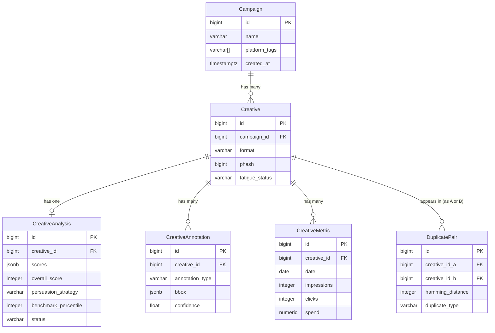
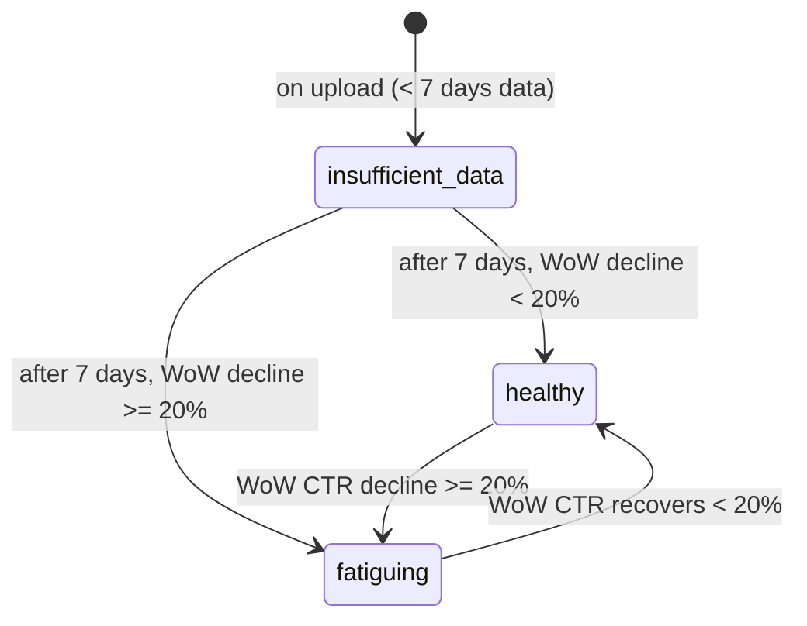
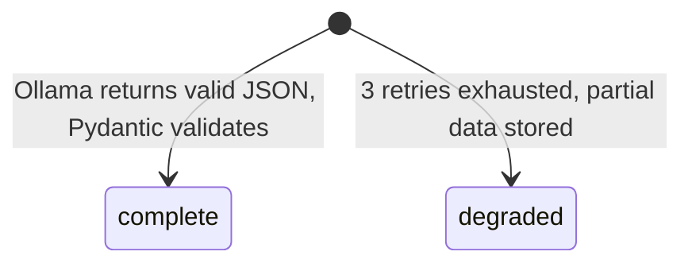

# Data Model: Creative Intelligence Platform

**Date:** 2026-05-14  
**Source:** [product-spec-v2.md](./product-spec-v2.md)

## Overview

Six tables covering campaigns, creatives, analysis results, annotations, daily KPI metrics, and duplicate pairs. PostgreSQL 15 with JSONB for flexible nested data (scores, annotations). Advisory locks on `creatives.phash` prevent duplicate race conditions.

---

## Entities

### Campaign

**Purpose:** Groups creatives by advertiser campaign context.

| Field | Type | Required | Description | Validation |
|---|---|---|---|---|
| id | BIGINT SERIAL | Yes | Primary key | Auto-generated |
| name | VARCHAR(255) | Yes | Campaign display name | Non-empty |
| platform_tags | VARCHAR[] | No | e.g. ['facebook','google'] | Array of strings |
| created_at | TIMESTAMPTZ | Yes | Creation time | Auto-set |
| updated_at | TIMESTAMPTZ | Yes | Last update | Auto-set |

**Indexes:**
- Primary: `id`
- `idx_campaigns_created_at`: `created_at DESC`

```json
{
  "$schema": "http://json-schema.org/draft-07/schema#",
  "type": "object",
  "properties": {
    "id": { "type": "integer" },
    "name": { "type": "string", "minLength": 1, "maxLength": 255 },
    "platform_tags": { "type": "array", "items": { "type": "string" } },
    "created_at": { "type": "string", "format": "date-time" },
    "updated_at": { "type": "string", "format": "date-time" }
  },
  "required": ["id", "name", "created_at", "updated_at"]
}
```

---

### Creative

**Purpose:** Represents a single uploaded ad asset (image or video).

| Field | Type | Required | Description | Validation |
|---|---|---|---|---|
| id | BIGINT SERIAL | Yes | Primary key | Auto-generated |
| campaign_id | BIGINT | Yes | FK → campaigns.id | ON DELETE CASCADE |
| filename | VARCHAR(512) | Yes | Original upload filename | Non-empty |
| storage_path | VARCHAR(1024) | Yes | Absolute path on disk | Non-empty |
| format | VARCHAR(10) | Yes | jpg/png/webp/gif/mp4/mov | Enum |
| width | INTEGER | No | Pixel width | > 0 |
| height | INTEGER | No | Pixel height | > 0 |
| duration_seconds | FLOAT | No | Video duration (NULL for images) | > 0 if present |
| file_size_bytes | BIGINT | Yes | File size | > 0 |
| phash | BIGINT | Yes | 64-bit perceptual hash (unique) | Computed on ingest |
| fatigue_status | VARCHAR(20) | Yes | healthy/fatiguing/insufficient_data | Default: insufficient_data |
| created_at | TIMESTAMPTZ | Yes | Upload time | Auto-set |
| updated_at | TIMESTAMPTZ | Yes | Last update | Auto-set |

**Relationships:**
- `belongs_to Campaign via campaign_id`
- `has_one CreativeAnalysis`
- `has_many CreativeAnnotations`
- `has_many CreativeMetrics`
- `has_many DuplicatePairs (as creative_id_a or creative_id_b)`

**Indexes:**
- Primary: `id`
- `idx_creatives_campaign_id`: `campaign_id`
- `idx_creatives_phash`: `phash` (for duplicate lookup)
- `idx_creatives_fatigue_status`: `fatigue_status`

**Constraints:**
- `UNIQUE (phash)` — enforced at DB level; advisory lock used for safe concurrent insert

```json
{
  "$schema": "http://json-schema.org/draft-07/schema#",
  "type": "object",
  "properties": {
    "id": { "type": "integer" },
    "campaign_id": { "type": "integer" },
    "filename": { "type": "string" },
    "format": { "type": "string", "enum": ["jpg","png","webp","gif","mp4","mov"] },
    "width": { "type": "integer", "minimum": 1 },
    "height": { "type": "integer", "minimum": 1 },
    "duration_seconds": { "type": ["number", "null"] },
    "file_size_bytes": { "type": "integer", "minimum": 1 },
    "phash": { "type": "integer" },
    "fatigue_status": { "type": "string", "enum": ["healthy","fatiguing","insufficient_data"] }
  },
  "required": ["id", "campaign_id", "filename", "format", "file_size_bytes", "phash", "fatigue_status"]
}
```

---

### CreativeAnalysis

**Purpose:** Stores AI analysis results for a creative.

| Field | Type | Required | Description | Validation |
|---|---|---|---|---|
| id | BIGINT SERIAL | Yes | Primary key | Auto-generated |
| creative_id | BIGINT | Yes | FK → creatives.id | UNIQUE, ON DELETE CASCADE |
| scores | JSONB | Yes | 7 dimension scores (integers 0–10) | See schema below |
| overall_score | INTEGER | Yes | Computed average of 7 scores | 0–10 |
| persuasion_strategy | VARCHAR(50) | Yes | fear_appeal/fomo/aspirational/social_proof/rational/unknown | Enum |
| dominant_emotion | VARCHAR(50) | Yes | excitement/fear/trust/joy/sadness/neutral/unknown | Enum |
| strengths | JSONB | Yes | Array of strength strings | Min 0, max 5 items |
| weaknesses | JSONB | Yes | Array of weakness strings | Min 0, max 5 items |
| recommendations | JSONB | Yes | Array of 3 recommendation strings | Exactly 3 items |
| explanation | TEXT | Yes | Natural language explanation | Non-empty |
| benchmark_percentile | INTEGER | No | 1–100 percentile rank | 1–100 |
| benchmark_corpus_size | INTEGER | No | Number of creatives in benchmark | ≥ 500 |
| status | VARCHAR(20) | Yes | complete/degraded | Default: complete |
| analysed_at | TIMESTAMPTZ | Yes | Analysis completion time | Auto-set |

**Scores JSONB schema:**
```json
{
  "hook_strength": 8,
  "cta_clarity": 5,
  "visual_quality": 7,
  "message_clarity": 6,
  "emotional_resonance": 9,
  "social_proof": 3,
  "brand_consistency": 7
}
```

**Indexes:**
- Primary: `id`
- `idx_analyses_creative_id`: `creative_id` (UNIQUE)
- `idx_analyses_overall_score`: `overall_score DESC`
- `idx_analyses_benchmark_percentile`: `benchmark_percentile`

---

### CreativeAnnotation

**Purpose:** Bounding boxes for detected visual elements (face, text, CTA).

| Field | Type | Required | Description | Validation |
|---|---|---|---|---|
| id | BIGINT SERIAL | Yes | Primary key | Auto-generated |
| creative_id | BIGINT | Yes | FK → creatives.id | ON DELETE CASCADE |
| annotation_type | VARCHAR(20) | Yes | face/text/cta | Enum |
| bbox | JSONB | Yes | {x, y, w, h} in pixels | All values ≥ 0 |
| label | VARCHAR(255) | No | Text content (for text/cta type) | Nullable |
| confidence | FLOAT | Yes | Detection confidence | 0.0–1.0 |

**Indexes:**
- Primary: `id`
- `idx_annotations_creative_id`: `creative_id`

**Bbox JSONB schema:**
```json
{ "x": 120, "y": 45, "w": 230, "h": 310 }
```

---

### CreativeMetric

**Purpose:** Daily per-creative performance KPI data.

| Field | Type | Required | Description | Validation |
|---|---|---|---|---|
| id | BIGINT SERIAL | Yes | Primary key | Auto-generated |
| creative_id | BIGINT | Yes | FK → creatives.id | ON DELETE CASCADE |
| date | DATE | Yes | Metric date | Not in future |
| impressions | INTEGER | Yes | Total impressions | ≥ 0 |
| clicks | INTEGER | Yes | Total clicks | ≥ 0, ≤ impressions |
| installs | INTEGER | Yes | Total installs | ≥ 0, ≤ clicks |
| spend | NUMERIC(12,4) | Yes | Spend in USD | ≥ 0 |
| revenue | NUMERIC(12,4) | Yes | Revenue in USD | ≥ 0 |

**Derived KPIs (computed, not stored):**
- `CTR = clicks / impressions` (NULL if impressions = 0)
- `CVR = installs / clicks` (NULL if clicks = 0)
- `CPI = spend / installs` (NULL if installs = 0)
- `ROAS = revenue / spend` (NULL if spend = 0)

**Indexes:**
- Primary: `id`
- `idx_metrics_creative_date`: `(creative_id, date)` UNIQUE
- `idx_metrics_creative_id`: `creative_id`
- `idx_metrics_date`: `date DESC`

---

### DuplicatePair

**Purpose:** Records detected duplicate/near-duplicate creative pairs.

| Field | Type | Required | Description | Validation |
|---|---|---|---|---|
| id | BIGINT SERIAL | Yes | Primary key | Auto-generated |
| creative_id_a | BIGINT | Yes | FK → creatives.id | ON DELETE CASCADE |
| creative_id_b | BIGINT | Yes | FK → creatives.id | ON DELETE CASCADE |
| hamming_distance | INTEGER | Yes | pHash Hamming distance | 0–10 |
| duplicate_type | VARCHAR(20) | Yes | self/cross_platform | Enum |
| detected_at | TIMESTAMPTZ | Yes | Detection time | Auto-set |

**Constraints:**
- `UNIQUE (creative_id_a, creative_id_b)` — no duplicate pair rows

**Indexes:**
- Primary: `id`
- `idx_duplicates_creative_a`: `creative_id_a`
- `idx_duplicates_creative_b`: `creative_id_b`

---

## Relationships Diagram



---

## State Transitions

### Creative.fatigue_status



### CreativeAnalysis.status



---

## Validation Rules

| Rule ID | Entity | Rule | Error |
|---|---|---|---|
| BR-001 | Creative | format must be jpg/png/webp/gif/mp4/mov | 415 Unsupported Media Type |
| BR-002 | Creative | video duration >= 3s | 422: "Video must be at least 3 seconds" |
| BR-003 | Creative | file_size <= 20MB (image) or 500MB (video) | 413: "File exceeds size limit" |
| BR-004 | Creative | phash must be unique (advisory lock) | 409: duplicate_detected: true |
| BR-005 | CreativeMetric | clicks <= impressions | 422: "Clicks cannot exceed impressions" |
| BR-006 | CreativeMetric | (creative_id, date) must be unique | Upsert on conflict |
| BR-007 | CreativeAnalysis | benchmark_percentile in range 1–100 | Clamped by service layer |
| BR-008 | CreativeAnalysis | recommendations array length == 3 | Pydantic validator |

---

## Migration Notes

### Initial Migration (Alembic revision 001)

```sql
CREATE TABLE campaigns (
    id BIGSERIAL PRIMARY KEY,
    name VARCHAR(255) NOT NULL,
    platform_tags VARCHAR[] DEFAULT '{}',
    created_at TIMESTAMPTZ NOT NULL DEFAULT NOW(),
    updated_at TIMESTAMPTZ NOT NULL DEFAULT NOW()
);

CREATE TABLE creatives (
    id BIGSERIAL PRIMARY KEY,
    campaign_id BIGINT NOT NULL REFERENCES campaigns(id) ON DELETE CASCADE,
    filename VARCHAR(512) NOT NULL,
    storage_path VARCHAR(1024) NOT NULL,
    format VARCHAR(10) NOT NULL CHECK (format IN ('jpg','png','webp','gif','mp4','mov')),
    width INTEGER,
    height INTEGER,
    duration_seconds FLOAT,
    file_size_bytes BIGINT NOT NULL,
    phash BIGINT NOT NULL UNIQUE,
    fatigue_status VARCHAR(20) NOT NULL DEFAULT 'insufficient_data'
        CHECK (fatigue_status IN ('healthy','fatiguing','insufficient_data')),
    created_at TIMESTAMPTZ NOT NULL DEFAULT NOW(),
    updated_at TIMESTAMPTZ NOT NULL DEFAULT NOW()
);
CREATE INDEX idx_creatives_campaign_id ON creatives(campaign_id);
CREATE INDEX idx_creatives_phash ON creatives(phash);
CREATE INDEX idx_creatives_fatigue_status ON creatives(fatigue_status);

CREATE TABLE creative_analyses (
    id BIGSERIAL PRIMARY KEY,
    creative_id BIGINT NOT NULL UNIQUE REFERENCES creatives(id) ON DELETE CASCADE,
    scores JSONB NOT NULL,
    overall_score INTEGER NOT NULL CHECK (overall_score BETWEEN 0 AND 10),
    persuasion_strategy VARCHAR(50) NOT NULL,
    dominant_emotion VARCHAR(50) NOT NULL,
    strengths JSONB NOT NULL DEFAULT '[]',
    weaknesses JSONB NOT NULL DEFAULT '[]',
    recommendations JSONB NOT NULL DEFAULT '[]',
    explanation TEXT NOT NULL,
    benchmark_percentile INTEGER CHECK (benchmark_percentile BETWEEN 1 AND 100),
    benchmark_corpus_size INTEGER,
    status VARCHAR(20) NOT NULL DEFAULT 'complete' CHECK (status IN ('complete','degraded')),
    analysed_at TIMESTAMPTZ NOT NULL DEFAULT NOW()
);
CREATE INDEX idx_analyses_overall_score ON creative_analyses(overall_score DESC);

CREATE TABLE creative_annotations (
    id BIGSERIAL PRIMARY KEY,
    creative_id BIGINT NOT NULL REFERENCES creatives(id) ON DELETE CASCADE,
    annotation_type VARCHAR(20) NOT NULL CHECK (annotation_type IN ('face','text','cta')),
    bbox JSONB NOT NULL,
    label VARCHAR(255),
    confidence FLOAT NOT NULL CHECK (confidence BETWEEN 0 AND 1)
);
CREATE INDEX idx_annotations_creative_id ON creative_annotations(creative_id);

CREATE TABLE creative_metrics (
    id BIGSERIAL PRIMARY KEY,
    creative_id BIGINT NOT NULL REFERENCES creatives(id) ON DELETE CASCADE,
    date DATE NOT NULL,
    impressions INTEGER NOT NULL DEFAULT 0,
    clicks INTEGER NOT NULL DEFAULT 0,
    installs INTEGER NOT NULL DEFAULT 0,
    spend NUMERIC(12,4) NOT NULL DEFAULT 0,
    revenue NUMERIC(12,4) NOT NULL DEFAULT 0,
    UNIQUE (creative_id, date)
);
CREATE INDEX idx_metrics_creative_date ON creative_metrics(creative_id, date DESC);

CREATE TABLE duplicate_pairs (
    id BIGSERIAL PRIMARY KEY,
    creative_id_a BIGINT NOT NULL REFERENCES creatives(id) ON DELETE CASCADE,
    creative_id_b BIGINT NOT NULL REFERENCES creatives(id) ON DELETE CASCADE,
    hamming_distance INTEGER NOT NULL CHECK (hamming_distance BETWEEN 0 AND 10),
    duplicate_type VARCHAR(20) NOT NULL CHECK (duplicate_type IN ('self','cross_platform')),
    detected_at TIMESTAMPTZ NOT NULL DEFAULT NOW(),
    UNIQUE (creative_id_a, creative_id_b)
);
CREATE INDEX idx_duplicates_creative_a ON duplicate_pairs(creative_id_a);
CREATE INDEX idx_duplicates_creative_b ON duplicate_pairs(creative_id_b);
```

### Rollback

```sql
DROP TABLE IF EXISTS duplicate_pairs;
DROP TABLE IF EXISTS creative_metrics;
DROP TABLE IF EXISTS creative_annotations;
DROP TABLE IF EXISTS creative_analyses;
DROP TABLE IF EXISTS creatives;
DROP TABLE IF EXISTS campaigns;
```
