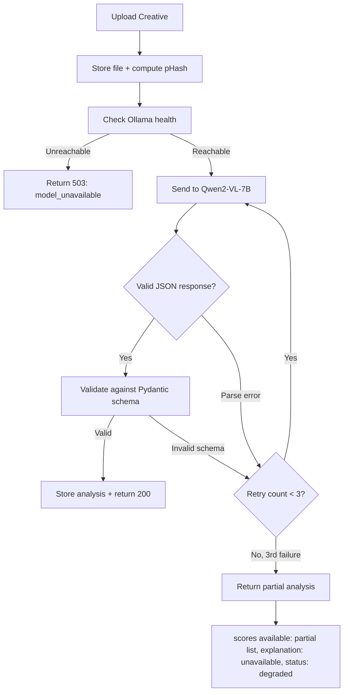
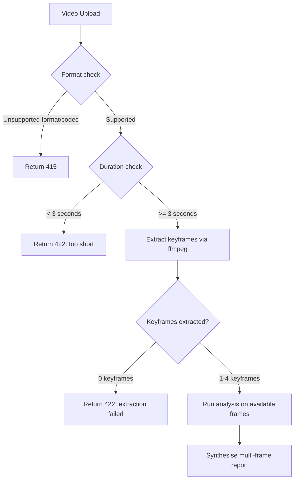
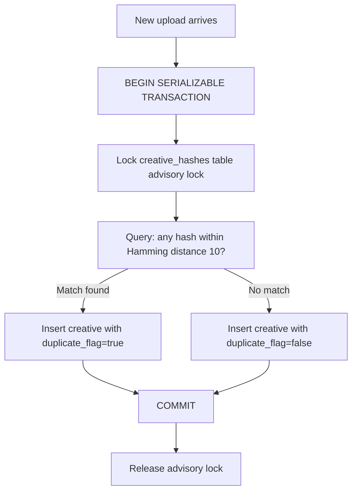

# PRD v2: Creative Intelligence Platform

**Status:** Revised  
**Author:** mukey@kochava.com  
**Date:** 2026-05-14  
**Previous version:** PRD-creative-intelligence-platform.md  
**Timeline:** 1-week MVP for executive pitch

---

## Problem Statement

Mobile marketers running paid acquisition campaigns across Facebook, Google, TikTok, and other platforms have hundreds or thousands of active ad creatives simultaneously. They face four compounding problems:

1. **No unified view** — performance data (CTR, CVR, CPI, ROAS) is siloed per platform.
2. **Duplicate waste** — the same creative is often uploaded in multiple resized or recompressed variants, fragmenting attribution data.
3. **No creative understanding** — marketers know *which* creative performs better, but not *why*.
4. **Late fatigue detection** — teams discover burnout only after CTR has already crashed.

---

## Solution

A Creative Intelligence Platform that ingests ad creatives (images and videos), runs local AI analysis to explain why a creative works or doesn't, detects duplicates, and alerts on fatigue. All analysis runs on-premise via Qwen2-VL-7B through Ollama. No creative data leaves Kochava infrastructure.

---

## Supported Media Formats *(new in v2)*

| Type | Accepted Formats | Max File Size | Min Duration | Codec Requirements |
|---|---|---|---|---|
| Image | JPG, PNG, WebP, GIF (first frame only) | 20 MB | N/A | N/A |
| Video | MP4, MOV | 500 MB | 3 seconds | H.264 or H.265 only |

**Rejection behaviour:**
- File exceeds size limit → `413 Payload Too Large` + message: "File exceeds 20MB / 500MB limit"
- Video duration < 3 seconds → `422 Unprocessable Entity` + message: "Video must be at least 3 seconds"
- Unsupported codec → `415 Unsupported Media Type` + message: "Unsupported codec. Please re-export as H.264 or H.265 MP4"
- AVI, WMV, FLV → `415 Unsupported Media Type`

---

## Startup Requirements *(new in v2)*

These steps must complete before the API accepts any requests. Enforced by Docker Compose health checks.

1. **PostgreSQL ready** — connection established, all migrations applied
2. **Benchmark corpus indexed** — CVPR 2017 fallback corpus (500 images, bundled in repo) pre-indexed into DB. Full CVPR corpus (64K) indexed asynchronously post-startup if download is available.
3. **Seed data loaded** — synthetic KPI time-series data inserted (spec below)
4. **Ollama reachable** — `GET http://localhost:11434/api/tags` returns 200
5. **Model pre-warmed** — one dummy inference sent to Qwen2-VL-7B on startup to force memory mapping. API marked ready only after this completes.

> **CVPR 2017 download note:** Full dataset requires academic registration at https://people.cs.pitt.edu/~kovashka/ads/ (24–48h turnaround). A 500-image fallback corpus is bundled in `data/benchmark_fallback/` and used automatically if full corpus is absent. Benchmark percentiles computed against whichever corpus is available; response includes `benchmark_corpus_size` so the UI can indicate corpus scale.

---

## User Stories

### Creative Analysis

1. As a mobile marketer, I want to upload an image creative and receive a scored analysis across 7 dimensions, so that I understand at a glance where the creative is strong and where it is weak.

   **Acceptance criteria:**
   ```gherkin
   Given an image creative under 20MB in JPG/PNG/WebP format
   When I POST it to /campaigns/{id}/creatives
   Then within 30 seconds on M4 Pro 24GB with Qwen2-VL-7B Q4 loaded
   And the response includes all 7 dimension scores as integers 0–10
   And overall_score as integer 0–10
   And benchmark_percentile as integer 1–100
   And benchmark_corpus_size as integer >= 500
   ```

2. As a mobile marketer, I want to see a natural language explanation of why a creative works or doesn't, so that I can communicate reasoning to my creative team.

3. As a mobile marketer, I want to see my creative annotated with bounding boxes highlighting detected faces, text regions, and CTA elements, so that I can visually understand what the AI found.

   **Acceptance criteria:**
   ```gherkin
   Given an image containing a human face
   When the annotation pipeline runs
   Then at least one annotation of type "face" with confidence >= 0.6 is returned

   Given an image containing visible button or CTA text
   When the annotation pipeline runs
   Then at least one annotation of type "cta" is returned
   ```
   > Note: "product placement" detection is excluded from automated test scope — no ground truth available for automation.

4. As a mobile marketer, I want to upload a video creative and receive analysis of its opening scene, hook type, pacing, and key frames.

   **Acceptance criteria:**
   ```gherkin
   Given a video creative in MP4/MOV format, H.264 or H.265 codec, >= 3 seconds duration
   When I upload it
   Then keyframes are extracted at timestamps: 0s, 3s, 50% of duration, final second
   And analysis runs on all available keyframes (1–4)
   And the response includes hook_analysis covering the 0s keyframe
   And overall_score reflects all available keyframes
   ```

5. As a mobile marketer, I want to see a competitive benchmark percentile for my creative.

   **Acceptance criteria:**
   ```gherkin
   Given the benchmark corpus contains >= 500 indexed creatives
   When a creative analysis completes
   Then the response includes benchmark_percentile as integer 1–100
   And benchmark_corpus_size as integer >= 500
   ```

6. As a mobile marketer, I want to receive 3 specific, actionable recommendations for improving a creative.

7. As a mobile marketer, I want to upload a batch of creatives and see them ranked by predicted effectiveness.

8. As a creative strategist, I want to see the detected persuasion strategy (fear appeal, FOMO, aspirational, social proof, rational).

9. As a creative strategist, I want to see the detected dominant emotion for each creative.

10. As a mobile marketer, I want to upload a non-advertisement image and receive a clear rejection rather than a nonsensical analysis score.

    **Acceptance criteria:**
    ```gherkin
    Given an image that is not an advertisement (confidence < 0.4 from content classifier)
    When I upload it
    Then the API returns 422 with message "Uploaded image does not appear to be an advertisement"
    And no analysis record is created
    ```

### Duplicate Detection

11. As a campaign manager, I want the platform to automatically detect when I upload a creative that is a duplicate or near-duplicate of one already in the system.

    **Acceptance criteria:**
    ```gherkin
    Given creative A is already stored with pHash H_A
    When creative B is uploaded with pHash H_B where Hamming(H_A, H_B) <= 10
    Then the upload response includes duplicate_detected: true
    And matched_creative_ids lists creative A's ID
    And creative B is still stored (user decides whether to keep)

    Given the same image saved at JPEG quality 80 and quality 40
    When pHash is computed for both
    Then Hamming distance is <= 10

    Given the same image with a 50x50 pixel watermark added
    When pHash is computed for both
    Then Hamming distance is <= 10
    ```

12. As a campaign manager, I want to see which existing creatives a new upload is a duplicate of, including which platforms those duplicates are running on.

13. As a campaign manager, I want self-re-uploads to be handled gracefully — if I upload the same creative to the same campaign twice, I want a clear "already exists" message, not a cross-platform duplicate warning.

    **Acceptance criteria:**
    ```gherkin
    Given creative A exists in campaign C
    When the same file is uploaded to campaign C again within 60 seconds
    Then the response includes duplicate_type: "self" and message: "This creative already exists in this campaign"
    And duplicate_type: "cross_platform" is reserved for matches found in different campaigns
    ```

14. As a data analyst, I want duplicate creative groups consolidated in reporting.

### Fatigue Detection

15. As a campaign manager, I want the platform to automatically flag creatives where CTR has declined more than 20% week-over-week.

    **Acceptance criteria:**
    ```gherkin
    Given a creative has >= 7 days of daily CTR data
    And current week average CTR is >= 20% lower than prior week average CTR
    When fatigue detection runs
    Then creative fatigue_status is set to "fatiguing"

    Given a creative has < 7 days of daily CTR data
    When fatigue detection runs
    Then creative fatigue_status is set to "insufficient_data"
    And UI badge shows "Collecting data…" not a warning

    Given a creative has >= 7 days of data
    And WoW CTR decline is < 20%
    When fatigue detection runs
    Then creative fatigue_status is set to "healthy"
    ```

16. As a campaign manager, I want fatiguing creatives visually distinguished in the dashboard (red badge).

17. As a campaign manager, I want to see the fatigue trend chart (CTR over 30 days) for any creative.

18. As a campaign manager, I want a recommendation to refresh or pause a fatiguing creative.

### KPI Dashboard

19. As a mobile marketer, I want a unified dashboard showing CTR, CVR, CPI, and ROAS per creative.
20. As a mobile marketer, I want to filter by campaign, platform, creative format, and date range.
21. As a mobile marketer, I want to sort creatives by any KPI column.
22. As a marketing lead, I want aggregate KPIs per campaign.
23. As a marketing lead, I want to see which creative drives the most spend and most conversions.

### Campaign Management

24. As a campaign manager, I want to organise creatives into campaigns.
25. As a campaign manager, I want to create a campaign and upload multiple creatives in one step.
26. As a campaign manager, I want a campaign-level summary card.

---

## Error Handling Specification *(new in v2)*

### Analysis Engine Error Flow



### Video Pipeline Error Flow



### Duplicate Detection — Race Condition Prevention



> Implementation note: Use PostgreSQL advisory lock `pg_advisory_xact_lock(hash_bigint)` keyed on the pHash value to prevent race condition on simultaneous identical uploads.

---

## Implementation Decisions

### Modules

**1. Creative Ingestion Module**
- Accepts image (JPG/PNG/WebP/GIF) and video (MP4/MOV, H.264/H.265 only) uploads
- Validates format, codec, file size, video duration before storing
- Stores original file in local filesystem
- Extracts metadata: format, dimensions, duration, codec, file size
- For video: extracts keyframes at 0s, 3s, 50%, final second via ffmpeg
- Computes pHash immediately on ingestion

**2. Analysis Engine**
- On startup: sends dummy inference to pre-warm Qwen2-VL-7B (force memory map)
- Validates Ollama reachability before every analysis call
- Sends image (or video keyframes) to Qwen2-VL-7B via Ollama HTTP API
- Response validated against Pydantic schema before storage
- Retry up to 3 times on parse/schema failure (temperature=0 for retries)
- On 3rd failure: stores partial result with `status: "degraded"`
- Pre-analysis: content classifier check — rejects non-advertisement images (confidence < 0.4)
- Returns structured JSON: 7 dimension scores, persuasion_strategy, dominant_emotion, strengths, weaknesses, recommendations, explanation, benchmark_percentile, benchmark_corpus_size

**3. Deduplication Module**
- Computes 64-bit perceptual hash (DCT-based pHash) for every ingested creative
- On new upload: uses PostgreSQL serialisable transaction + advisory lock to prevent race condition
- Hamming distance ≤ 10 = duplicate
- Distinguishes `duplicate_type: "self"` (same campaign, < 60s) vs `duplicate_type: "cross_platform"`
- Resistance tested: JPEG quality 40, 50×50 watermark, ±20% resize

**4. Fatigue Detection Module**
- Requires minimum 7 days of daily CTR data before computing WoW change
- Status values: `healthy`, `fatiguing` (WoW decline ≥ 20%), `insufficient_data` (< 7 days)
- Runs as daily background job (not blocking API)
- Stores: fatigue_status, wow_decline_pct, trend_data (30-day daily CTR array)

**5. Benchmark Module**
- Bundled fallback corpus: 500 public-domain ad images in `data/benchmark_fallback/`
- Full CVPR 2017 corpus (64K): indexed asynchronously post-startup if download present
- Corpus pre-indexed at startup (blocking); async re-index on full corpus arrival
- Returns: percentile (1–100), benchmark_corpus_size, top-3 similar high-performing creatives

**6. KPI Aggregation Module**
- Stores per-creative daily metrics: impressions, clicks, installs, spend, revenue
- Derived KPIs: CTR = clicks/impressions, CVR = installs/clicks, CPI = spend/installs, ROAS = revenue/spend
- Aggregates to campaign level

**7. REST API Layer (FastAPI)**
- `GET /health` — checks Ollama, DB, benchmark corpus readiness
- `POST /campaigns` — create campaign
- `GET /campaigns` — list campaigns with aggregate KPIs
- `POST /campaigns/{id}/creatives` — upload creative(s)
- `GET /campaigns/{id}/creatives` — list creatives with scores + KPIs + fatigue status
- `GET /creatives/{id}` — full creative detail
- `GET /creatives/{id}/fatigue` — fatigue trend time-series
- `GET /creatives/{id}/duplicates` — duplicate matches

**8. Annotation Pipeline**
- OpenCV face detection (Haar cascade, confidence threshold: 0.6)
- Text region detection (Tesseract layout analysis)
- CTA heuristic: highest-contrast text region in lower 30% of frame
- Returns annotations: [{type, bbox: {x,y,w,h}, label, confidence}]
- Annotation types: `face`, `text`, `cta`
- Does NOT include `product_placement` (no ground truth for automated testing)

### Data Schema (key tables)

```sql
campaigns: id, name, platform_tags, created_at
creatives: id, campaign_id, filename, format, dimensions, duration, phash BIGINT UNIQUE, fatigue_status, created_at
creative_analyses: creative_id, scores JSONB, explanation TEXT, persuasion_strategy, emotion, strengths JSONB, weaknesses JSONB, recommendations JSONB, benchmark_percentile INT, benchmark_corpus_size INT, status (complete|degraded), analysed_at
creative_annotations: creative_id, annotation_type, bbox JSONB, label, confidence FLOAT
creative_metrics: creative_id, date DATE, impressions INT, clicks INT, installs INT, spend DECIMAL, revenue DECIMAL
duplicate_pairs: creative_id_a, creative_id_b, hamming_distance INT, duplicate_type VARCHAR, detected_at
```

### Seed Data Specification *(new in v2)*

The Docker Compose seed step must produce:

- **10 campaigns** with distinct names (Gaming, Fintech, E-commerce, etc.)
- **50 creatives** spread across campaigns (images + videos)
- **30 days of daily KPI data** per creative with realistic noise:
  - CTR: base 2.8–4.1%, daily variance ±15%, no round numbers
  - CVR: base 18–26%
  - CPI: base $1.20–$3.80
  - ROAS: base 1.8–4.2
- **At least 3 creatives** with CTR declining > 20% WoW (fatigue_status = "fatiguing")
- **At least 2 duplicate pairs** with Hamming distance ≤ 10

### Tech Stack

- **Backend:** Python 3.11, FastAPI, SQLAlchemy, Alembic, Pydantic v2
- **ML/Vision:** Ollama (Qwen2-VL-7B Q4), OpenCV, Pillow, imagehash, ffmpeg
- **Frontend:** React 18, Next.js 14, Ant Design 5
- **Infrastructure:** Docker Compose, PostgreSQL 15, Redis (session/cache)

### Network Isolation *(new in v2)*

Docker Compose network must set `internal: true` for all services except the initial seed download. During operation, no service may make outbound HTTP calls except to `localhost:11434` (Ollama). This enforces the "no data leaves Kochava infrastructure" guarantee and must be verified by integration test.

---

## Testing Decisions

**What makes a good test:** Tests verify observable behaviour through public API interfaces. No mocking of internal modules. No asserting on implementation details.

| Module | Test type | Acceptance criteria |
|---|---|---|
| Deduplication | Unit | Same image → Hamming 0. JPEG Q40 variant → ≤ 10. Different image → > 10. Concurrent upload → single non-duplicate record |
| Fatigue Detection | Unit | 14-day series with >20% WoW drop → fatiguing. Flat series → healthy. 5-day series → insufficient_data |
| KPI Aggregation | Unit | Daily rows → correct CTR/CVR/CPI/ROAS. Campaign rollup sums correctly. No round numbers in seed data |
| REST API | Integration | Upload creative → 201 + creative_id. Get detail → full JSON with all 7 scores. Ollama down → 503 |
| Analysis Engine | Integration (Ollama mock) | All 7 scores present, integers 0–10. Malformed JSON from model → retry, then degraded status. Non-ad image → 422 |
| Annotation Pipeline | Unit | Image with face → face annotation, confidence ≥ 0.6. No face → empty face list, no error |
| Video Ingestion | Unit | Video < 3s → 422. Unsupported codec → 415. H.264 MP4 → keyframes at correct timestamps |
| Network isolation | Integration | Analysis run → zero outbound HTTP calls except localhost:11434 |

---

## Out of Scope

- Live platform connectors (Facebook, Google, TikTok, AppsFlyer) — Phase 1
- Thompson Sampling / MAB — Phase 1
- A/B test management — Phase 1
- Real-time Kafka/Kinesis streaming — Phase 1
- User authentication / multi-tenancy — demo is single-tenant
- Fine-tuning Qwen2-VL on Kochava data — Phase 1
- SKAdNetwork / privacy attribution — Phase 2
- Budget optimisation and bidding — Phase 2
- External cloud deployment — demo runs locally

---

## Further Notes

**Model-agnostic architecture:** Analysis Engine hides Ollama behind a clean interface (`AnalysisProvider`). Swap to any VLM (GPT-4V, Gemini, fine-tuned model) by changing one config value.

**Demo checklist (pre-pitch):**
- [ ] Ollama running and model loaded (`ollama list` shows Qwen2-VL-7B)
- [ ] Docker Compose healthy (`/health` returns all green)
- [ ] Seed data present (3 fatiguing creatives visible in dashboard)
- [ ] Benchmark corpus indexed (corpus_size ≥ 500 in any analysis response)
- [ ] RAM free ≥ 12GB before demo starts (close Chrome tabs, Slack, Xcode)
- [ ] One "live" demo creative pre-selected (known good image, 5–10s analysis expected)
- [ ] Pre-computed results cached for all 50 seed creatives

---

## Revision Summary

### Changes from v1

| Critique ID | Issue | Resolution | Status |
|---|---|---|---|
| CG-001 | Qwen2-VL malformed JSON — no retry/validation | Added Pydantic schema validation + 3-retry logic + degraded partial response | Resolved |
| CG-002 | Ollama not running — no health check or user-facing error | Added `/health` endpoint, 503 on model unavailable, pre-warm on startup | Resolved |
| CG-003 | Fatigue detection with < 7 days data — undefined state | Added `insufficient_data` status, 7-day minimum, Gherkin AC | Resolved |
| CG-004 | Benchmark corpus not initialised — null percentile on first run | Added startup requirement for corpus init, bundled 500-image fallback corpus | Resolved |
| CG-005 | Race condition on simultaneous duplicate uploads | Added PostgreSQL advisory lock + serialisable transaction spec | Resolved |
| Risk-1 | CVPR 2017 requires academic registration (24–48h) | Bundled 500-image fallback corpus in repo; async upgrade to full corpus | Resolved |
| Risk-2 | Qwen2-VL cold start 30–60s | Added model pre-warm to startup sequence | Resolved |
| Risk-3 | Seed KPI data has round numbers | Added seed data spec with realistic noise ranges and variance | Resolved |
| Risk-4 | Unsupported video codecs fail silently | Added supported format table, 415 response, codec validation | Resolved |
| Risk-5 | No fatiguing creatives in seed data | Seed spec requires ≥ 3 creatives with >20% WoW CTR decline | Resolved |
| Medium-1 | Network isolation not enforced | Added Docker Compose network isolation spec + integration test requirement | Resolved |
| EC-1 | Self-duplicate vs cross-platform duplicate same UX | Added `duplicate_type` field: "self" vs "cross_platform" with distinct messages | Resolved |
| EC-2 | Video < 3s crashes ffmpeg | Added 3-second minimum duration with 422 rejection before ffmpeg runs | Resolved |
| EC-3 | Non-advertisement image gets nonsensical score | Added pre-analysis content check, 422 if ad confidence < 0.4 | Resolved |
| Testability-1 | "30 seconds" vague — hardware not specified | Gherkin AC specifies M4 Pro 24GB, Q4 quantisation, loaded model | Resolved |
| Testability-2 | Product placement not testable | Removed from automated test scope, noted in annotation module spec | Resolved |
| Testability-3 | Percentile example value used as requirement | Replaced with Gherkin AC requiring integer 1–100 + corpus_size field | Resolved |
| Testability-4 | pHash resistance tolerance undefined | Added JPEG Q40 + 50×50 watermark Gherkin criteria | Resolved |
| Testability-5 | "No data leaves infra" unenforceable | Added Docker network isolation + integration test | Resolved |

### Decisions Required

None. All critique items were auto-resolvable. No business trade-offs required stakeholder input.

### New Requirements Added

| Requirement | Description | Source |
|---|---|---|
| Supported Media Formats table | Format, codec, size, duration limits with rejection HTTP codes | Risk-4, EC-2 |
| Startup Requirements section | 5-step startup sequence with health checks and pre-warming | CG-002, CG-004, Risk-2 |
| Error Handling — Analysis Engine | MermaidJS flow: Pydantic validation, 3-retry, degraded partial response | CG-001 |
| Error Handling — Video Pipeline | MermaidJS flow: codec check, duration check, keyframe extraction | EC-2, Risk-4 |
| Error Handling — Duplicate Race Condition | MermaidJS flow: advisory lock + serialisable transaction | CG-005 |
| Seed Data Specification | 10 campaigns, 50 creatives, 30-day KPI data with noise, 3 fatiguing | CG-003, Risk-3, Risk-5 |
| Network Isolation requirement | Docker internal network, integration test, enforces data privacy claim | Medium-1, Testability-5 |
| Content classifier pre-check | Reject non-advertisement images before full analysis | EC-3 |
| Self vs cross-platform duplicate_type | Distinct UX messages for re-upload vs cross-campaign duplicate | EC-1 |
| Demo pre-pitch checklist | 8-item checklist covering RAM, model, corpus, seed data, live demo creative | Risk-2, Risk-5 |
